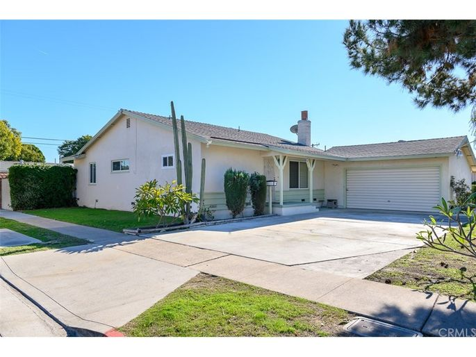

# 🏠Los-House-Prices房价预测

序列|代码笔记|博客链接
---|---|---
前期知识|01.机器学习完整技术栈 02.Pandas操作快查表|
基础训练|03.机器学习baseline|
特征工程|04.Seaborn操作快查表 数据预处理/空值填充|---
初步训练|---|---
线性回归|---|---
深度学习|---|---

- 特征工程:
- 线性回归
- 深度学习

